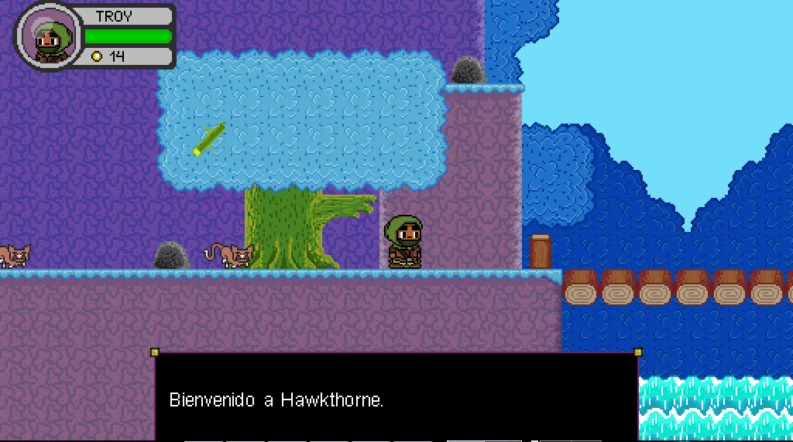
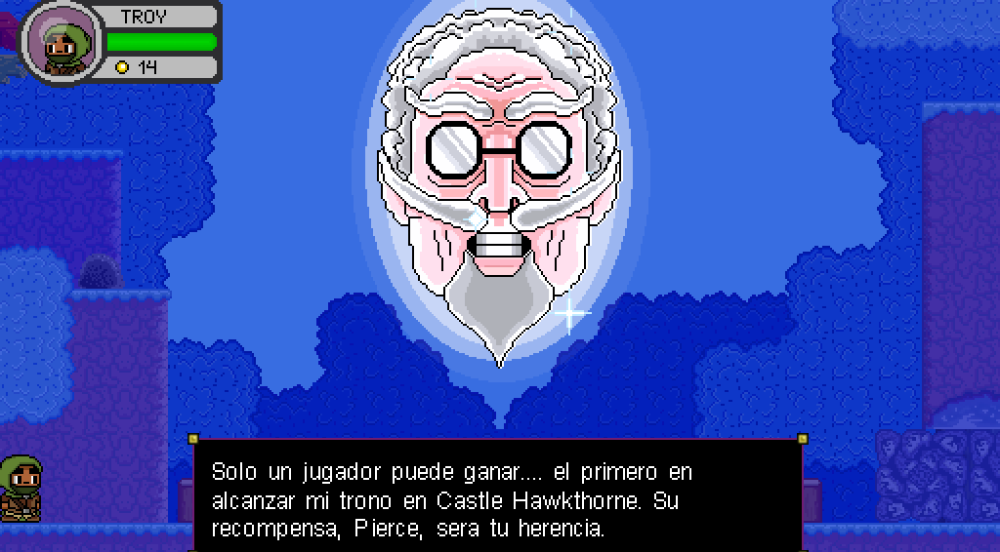

# Journey to the Center of Hawkthorne

Este juego de plataformas en 2d se basa en el programa Digital Estate Planning de Community.
episodio. Está construido usando el motor de juego [LÖVE](https://love2d.org/). Por favor
[reportar cualquier problema o error][githubissues] que tengas con el juego!

[estate]: http://en.wikipedia.org/wiki/Digital_Estate_Planning
[githubissues]: https://github.com/sodomon2/hawkthorne-journey-Spanish/issues?state=open


## Screenshot





## Descarga el juego

- [Develop](https://github.com/sodomon2/hawkthorne-journey-Spanish/archive/master.zip)

### Introducción al desarrollo en OS X / Linux / Windows

Comenzar es fácil. Simplemente clone el repositorio y ejecute `love`.

```bash
$ git clone https://github.com/sodomon2/hawkthorne-journey-Spanish
$ love hawkthorne-journey-Spanish
```

## License

A menos que se indique lo contrario, este código se licencia bajo la Licencia MIT.

Las obras de arte y los archivos de audio tienen licencia bajo [CC BY-NC
3.0](http://creativecommons.org/licenses/by-nc/3.0/). La obra de arte incluye todos
.png,.psd,.ogg, y archivos.wav.

